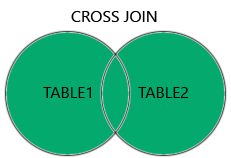

> # JOIN Statement:

A **JOIN** clause is used to combine rows from two or more tables, based on a related column between them. \
It allows you to retrieve data from multiple tables in a single query by specifying how the tables are related.

- JOINS allow us to combine data from more than one table into a single result set.
- The tables are mutually related using primary and foreign keys.
- JOINS have better performance compared to sub queries.
- **INNER JOINS** only return rows that meet the given criteria.
- **OUTER JOINS** can also return rows where no matches have been found. The unmatched rows are returned with the NULL keyword.
- The frequently used clause in JOIN operations is “ON”. “USING” clause requires that matching columns be of the same name.
- JOINS can also be used in other clauses such as **GROUP BY, WHERE, SUB QUERIES, AGGREGATE FUNCTIONS** etc.

Ques. Why should we use joins? \
Ans. 

## Types of JOIN
 1. Inner JOIN
 2. Outer JOIN
    - LEFT OUTER JOIN (or sometimes called LEFT JOIN)
    - RIGHT OUTER JOIN (or sometimes called RIGHT JOIN)
    - CROSS JOIN
 3. NATURAL JOIN
    - NATURAL LEFT JOIN
    - NATURAL RIGHT JOIN

<br>

<center style="background: 'white'; border-radius: '20px';">




</center>

 
### 1.  Inner JOIN: 
The **MySQL INNER JOIN** is used to return all rows from multiple tables where the join condition is satisfied. It is the most common type of join.

Syntax:
```sql
    SELECT column_name(s)
    FROM table1
    INNER JOIN table2
    ON table1.column_name = table2.column_name;
            OR
    SELECT column_name(s)
    FROM table1
    JOIN table2
    ON table1.column_name = table2.column_name;
```

Example:
```sql
    SELECT Orders.OrderID, Customers.CustomerName
    FROM Orders
    INNER JOIN Customers 
    ON Orders.CustomerID = Customers.CustomerID;
```

### 2. Outer JOIN: 
  - **LEFT OUTER JOIN:** \
    The LEFT JOIN keyword returns all records from the left table (table1), and the matching records (if any) from the right table (table2).
    If there are no matches, NULL values are returned for the right table columns.

    Syntax:
    ```sql
        SELECT column_name(s)
        FROM table1
        LEFT OUTER JOIN table2
        ON table1.column_name = table2.column_name;
                OR
        SELECT column_name(s)
        FROM table1
        LEFT JOIN table2
        ON table1.column_name = table2.column_name;
    ```
    
    Example:
    ```sql
        SELECT Customers.CustomerName, Orders.OrderID
        FROM Customers
        LEFT JOIN Orders 
        ON Customers.CustomerID = Orders.CustomerID
        ORDER BY Customers.CustomerName;
    ```

  - **RIGHT OUTER JOIN:** \
    The RIGHT JOIN keyword returns all records from the right table (table2), and the matching records (if any) from the left table (table1). If there are no matches, NULL values are returned for the left table columns.\
    Note: The RIGHT JOIN keyword returns all records from the right table (Employees), even if there are no matches in the left table (Orders).

    Syntax:
    ```sql
        SELECT column_name(s)
        FROM table1
        RIGHT OUTER JOIN table2
        ON table1.column_name = table2.column_name;
                OR
        SELECT column_name(s)
        FROM table1
        RIGHT JOIN table2
        ON table1.column_name = table2.column_name;
    ```
    
    Example:
    ```sql
        SELECT Orders.OrderID, Employees.LastName, Employees.FirstName
        FROM Orders
        RIGHT JOIN Employees 
        ON Orders.EmployeeID = Employees.EmployeeID
        ORDER BY Orders.OrderID;
    ```

  - **CROSS JOIN:** \
    The CROSS JOIN keyword returns all records from both tables (table1 and table2). \
    This means it combines each row of the first table with every row of the second table, resulting in a potentially large result set. \
    If you add a WHERE clause (if table1 and table2 has a relationship), the CROSS JOIN will produce the same result as the INNER JOIN clause: 

    Syntax:
    ```sql
        SELECT column_name(s)
        FROM table1
        CROSS JOIN table2;
    ```
    
    Example:
    ```sql
        SELECT Customers.CustomerName, Orders.OrderID
        FROM Customers
        CROSS JOIN Orders;
    ```

### 3. NATURAL JOIN: 
A **NATURAL JOIN** is a type of join in SQL that automatically matches columns with the same name from the two tables being joined. It doesn't require explicitly specifying the columns to join on using the **ON** keyword. \
It returns all rows where the values in the matching columns are equal.

> [!NOTE]
> When you use **NATURAL JOIN** without specifying **LEFT** or **RIGHT**, it defaults to an **INNER JOIN**. This means that only the rows with matching values in the columns with the same name from both tables will be included in the result set.

- **NATURAL LEFT JOIN:** \
  Returns all rows from the left table (table1), and the matched rows from the right table (table2). If there are no matches, NULL values are returned for the columns of the right table.

    Syntax:
    ```sql
        SELECT *
        FROM table1
        NATURAL LEFT JOIN table2;
    ```

- **NATURAL RIGHT JOIN:** \
  Returns all rows from the right table (table2), and the matched rows from the left table (table1). If there are no matches, NULL values are returned for the columns of the left table.

    Syntax:
    ```sql
        SELECT *
        FROM table1
        NATURAL RIGHT JOIN table2;
    ```

